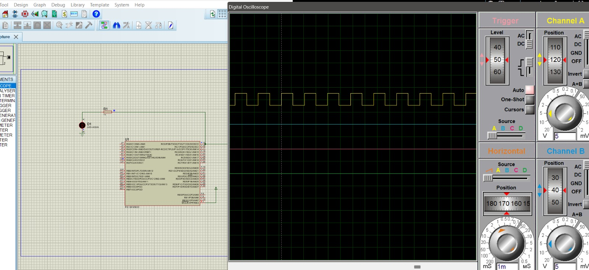
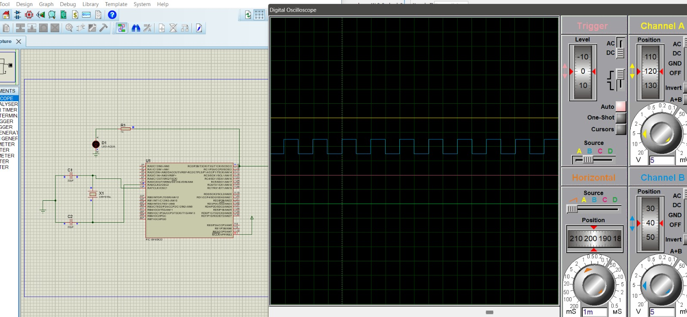
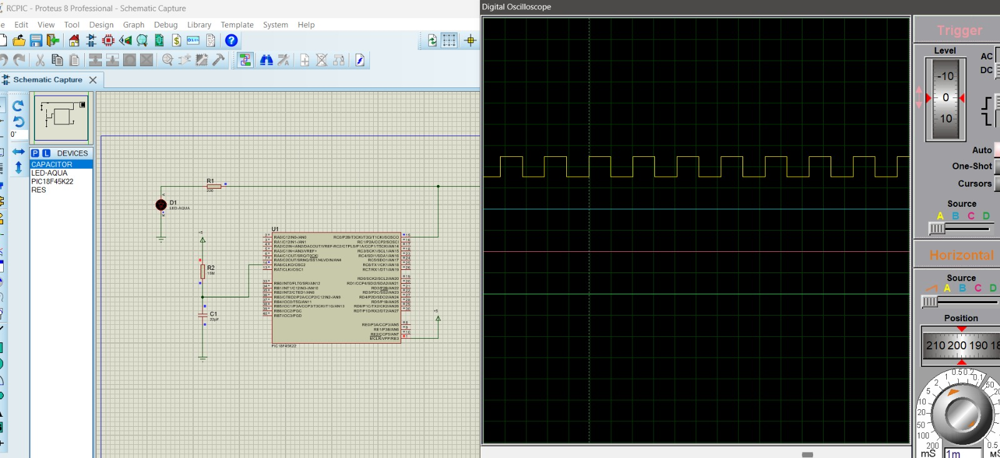
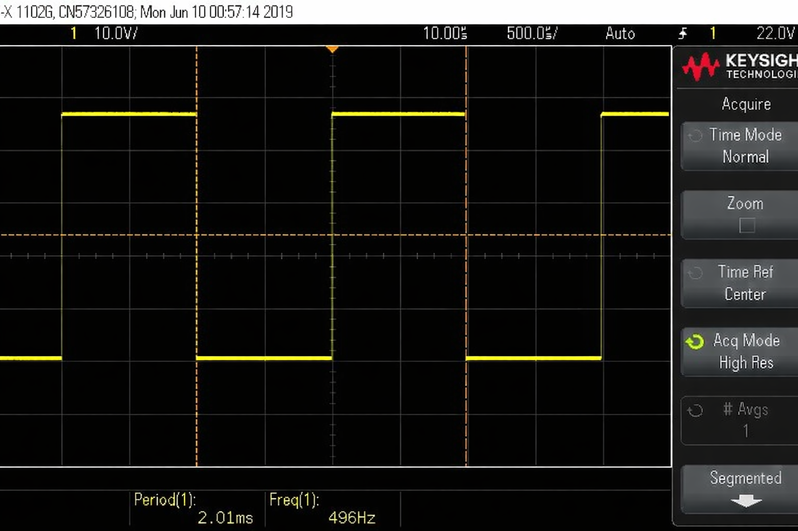
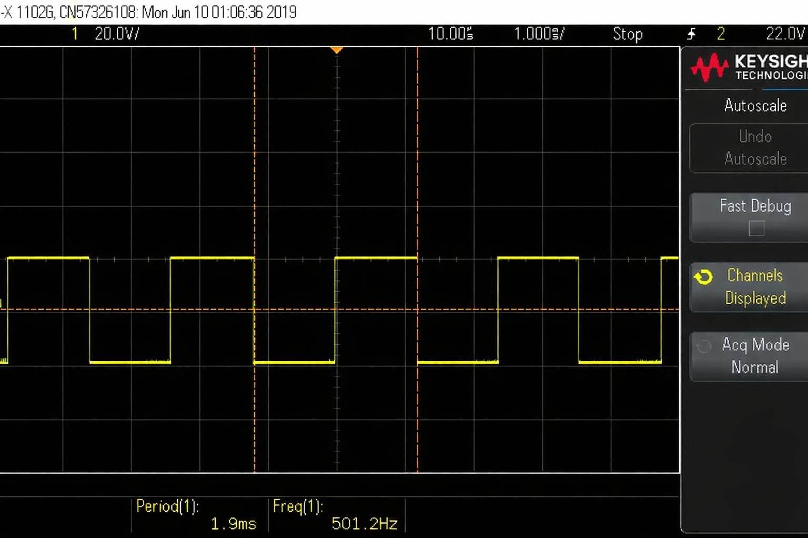
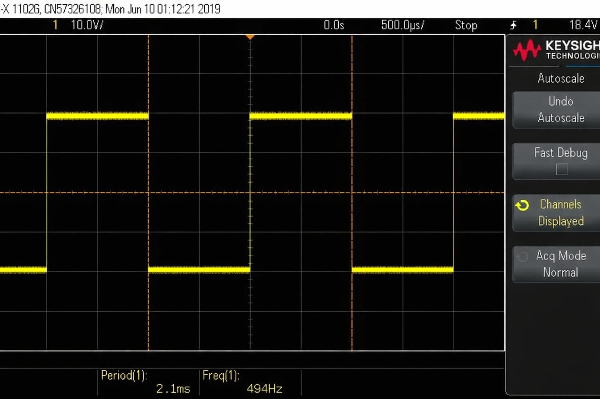
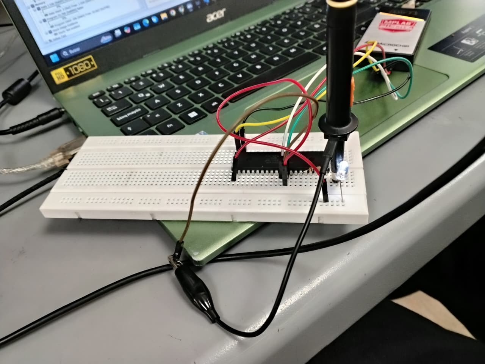
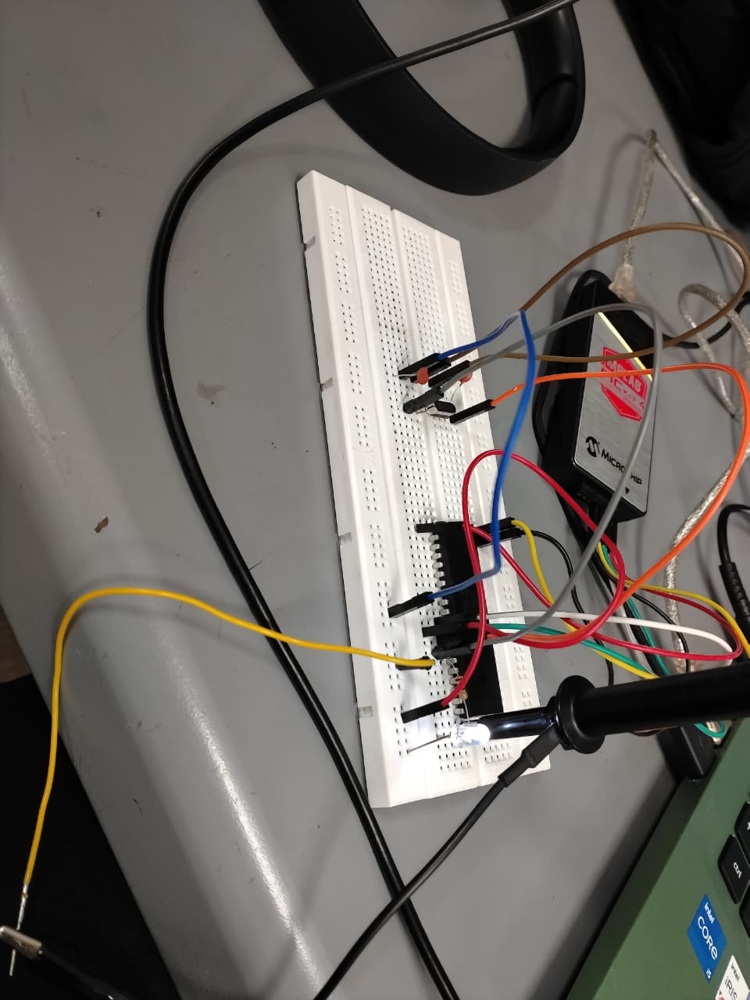
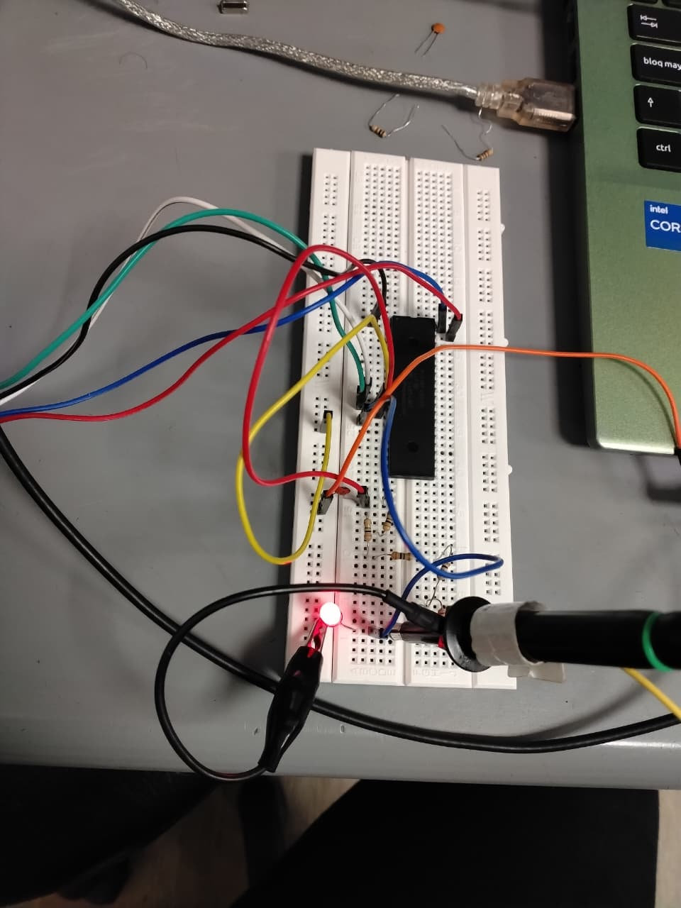

# Lab02 - Caracterización de osciladores (externo vs. interno)

## 1. Integrantes

* [Samuel Forero](https://github.com/Sam232510)

* [Danna Pineda](https://github.com/Danna-pineda)

## 2. Documentación

### 2.1 Descripción del laboratorio

### 2.2 Explicación del código implementado

### 2.3 Análisis y comparación

A continuación se presentan diferentes tablas las cuales nos dan a entender cual fue el comportamiento de cada una de las señales generadas y comparando su porcentaje de error en cuanto a lo teorico a lo obtenido. Al igual realizando unas pequeñas variaciones como la temperatura a ver como puede influir dentro de las oscilaciones que se generan.

#### Tabla 1: Medición en frío

| Modo de oscilador | Freq. teórica Fosc | RA6 medible (CLKO)? | Freq. medida RA6 (Hz) | Freq. teórica RC0 (Hz)| Freq. medida RC0 (Hz) | Error RC0 (%) |  
|------------------|------------------|---------------------|---------------|---------------------|---------------|---------------|
| INTOSC (interno) | 16,000,000       | Sí                 |  31.4                   |                500                 | 496              |    0.8           | |
| HS (cristal externo 16 MHz) | 16,000,000 | No |     NA      |              500                 |  501.2             |            0.24   |
| RC externo       | ~16,000,000*     | No                                    |       N/A        | 500                 |    494           |      1.2         | |

#### Tabla 2: Medición con calor

| Modo de oscilador | Freq. teórica Fosc | RA6 medible (CLKO)? | Freq. medida RA6 (Hz) | Freq. teórica RC0 (Hz)| Freq. medida RC0 (Hz) | Error RC0 (%) |  
|------------------|------------------|---------------------|---------------|---------------------|---------------|---------------|
| INTOSC (interno) | 16,000,000       | Sí                 |  Sin señal                   |                500                 |   523            |     4.6          | |
| HS (cristal externo 16 MHz) | 16,000,000 | No |     NA      |               500                 |     499          |       0.2        |
| RC externo       | ~16,000,000*     | No                                    |       N/A        | 500                 |   528            |   5.6            | |

#### Tabla 3: Deriva

| Modo de oscilador |RC0 deriva (Hz) |
|------------------|--------------------|
| INTOSC (interno) |      4              |                
| HS (cristal externo 16 MHz) |       1.2         |                |
| RC externo       |     6            |                

<!-- Agregar tablas para valores usando PLL -->

<!-- Complemente con análisis de lo registrado en tablas -->

## 2.4 Diagramas

A partir de los siguientes diagramas se observo el comportamiento de cada uno de los circuitos de manera simulada para así verificar y asegurar que a el momento de la implementación fuera cierta y sin ningun tipo de problema. Las simulaciones ceuntan con el codigo de implementación en formato .hex dentro de el software proteus para observar los diferentes comportamientos.

* Simulación Oscilador Interno

* Simulación Cristal 16MHz

* Simulación Circuito RC

## 2.5 Formas de onda

### INTOSC (interno) 

En esta imagen se observa la señal que nos genera el oscilador interno de el PIC18F45K22, siempre y cuando tenemos el modo 1 dentro de el codigo el cual nos activa un señal de 900000UL ya que es el que hace que funcione el oscilador interno. 
### HS

En esta imagen se logra observar la señal que se genera gracias a la conexión entre dos condensadores y el cristal de 16MHz.
## RC

En el tercer modo se observa la señal de 500Hz que se logra generar a traves de el circuito RC.
## 3. Evidencias de implementación

En esta imagen se evidencia el diseño de el circuito en la realidad, en donde se realiza la oncexión a traves de el PICKIT4 junto a el PIC18F45K22 para que de esta forma se aliemnte y pueda compilar el codigo establecido. En el cual la señal que se obtiene dentro de el pic es llevada a el pin 15 (RC0) para así lograr observar lo que establece dentro del programa,

En esta imagen se evidencia el diseño de el circuito en la realidad, en donde se realiza la oncexión a traves de el PICKIT4 junto a el PIC18F45K22 en donde el oscilador de cristal junto a los 2 condensadores de 22pf en donde se envia una señal a la entrada (pin13) y la otra a la salida (pin14) para que de esta forma se genere una unica señal de salida y no se afecte entre el cristal y el oscilador interno de el PIC.

Para el circuito RC lo que se realiza es por medio de la formula de la frecuencia calcular los valores de los componentes que se necesitan, en nuestro caso se asumio un condensador de 22pf y se calculo la resistencia de la siguiente forma.

$$
f = \frac{1}{2\pi R C}
$$

En donde lo que se debe hacer es el despeje de la R ya que se conoce los demas datos.

$$
R = \frac{1}{2\pi f C}
$$

Ahora remplazamos y obtenemos.

$$
R = \frac{1}{2\pi (500)(22pf) }
$$

$$
R = 14MΩ  
$$

De esta forma la señal que nos segenera el RC se manda a el pin 13 el cual es una entrada de oscilaciones y en el pin 14 se observa la salida de estas oscilaciones obteniendo el resultado esperado.
## 4. Preguntas

* ¿En qué modo se obtuvo la medición más cercana a la frecuencia teórica?

Dentro de todos los modos se obtuvo una respuesta muy cercana a la teorica, pero en el que más nos acercamos fue en el de Cristal ya que esta se pasaba por 1Hz, pero esto fue gracias a la buena efectividad dentro de los componentes y la frecuencia decidida que se propone dentro de el codigo.

* ¿Fue posible evidenciar el fenómeno de deriva? ¿Qué factores podrían explicar la variación de frecuencia al calentar el PIC?

Sí, fue posible evidenciar el fenómeno de deriva. Al calentar el microcontrolador, la frecuencia de la señal generada presentó pequeñas variaciones respecto al valor inicial. Esto se puede observar en el osciloscopio cuando el periodo cambia ligeramente, lo que implica que la frecuencia ya no es exactamente la misma.

Este comportamiento ocurre porque la frecuencia del oscilador interno del microcontrolador no es perfectamente estable, y puede variar debido a cambios en las condiciones físicas, como la temperatura

* ¿Cuál es más preciso en cuanto a frecuencia teórica vs. medida?

* Explique cómo usar RC0 para estimar la frecuencia del oscilador cuando RA6 no está disponible.

* Si se quisiera duplicar la frecuencia del PIC usando PLL, ¿en qué modos se podría aplicar?

* Enliste ventajas y desventajas de cada modo.

## 5. Referencias